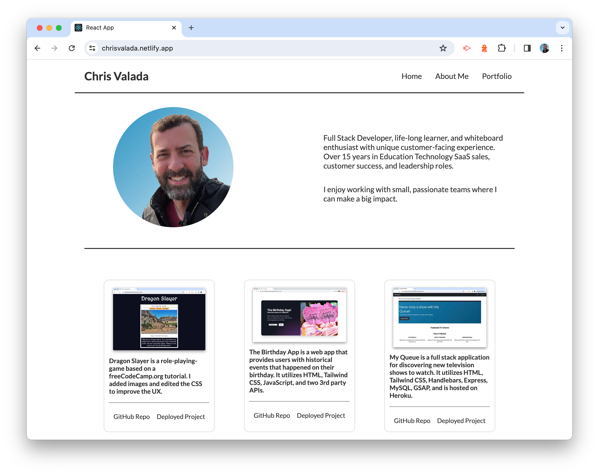

# React Portfolio

## Description 

This portfolio uses React to showcase my work. 

## Table of Contents

- [Description](#description)
- [Screenshots](#screenshots)
- [Usage](#usage)
- [Credits](#credits)
- [Licenses](#licenses)

## Screenshots

## Usage
Simply visit the URL to begin using the site. 
https://merry-mousse-38a0d4.netlify.app/

## Credits

Chris Valada
GitHub.com/clvalada

## License

MIT License